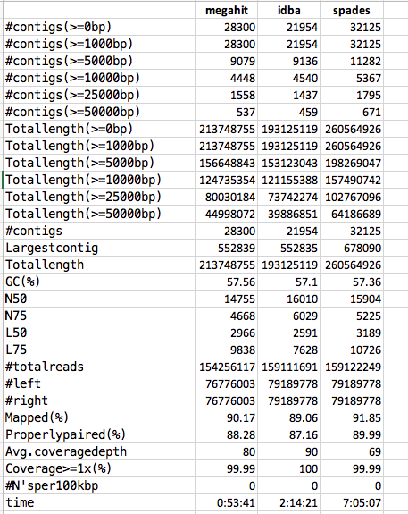

# Metagenomic assembly and binning

In class today, we are going to use the assembler **megahit**.  MEGAHIT is an ultra-fast and memory-efficient NGS assembler. It is optimized for metagenomes, but also works well on generic single genome assembly (small or mammalian size) and single-cell assembly.

https://github.com/voutcn/megahit
https://academic.oup.com/bioinformatics/article/31/10/1674/177884

### Install megahit
Create a new conda environment called *assembly*, activate it and install ```megahit```

```conda create --name assembly```
```conda activate assembly```
```conda install -c bioconda megahit```

## Quality Assessment  (meta)Genome Assemblies
To evaluate the metagenomic assembly, we will use **quast**

https://academic.oup.com/bioinformatics/article/29/8/1072/228832
http://quast.bioinf.spbau.ru/manual.html

### Install quast
Deactivate the previous environment and create a new calles *quast* you created and install *quast*

```conda install -c conda-forge -c bioconda quast```


## Assembly metagenomes from hot springs
We are going to use the datasets from Saxena et al., 2017
https://www.frontiersin.org/articles/10.3389/fmicb.2016.02123/full

You will find the trimmed paired-end datasets in 

```/vortexfs1/omics/env-bio/collaboration/common-materials/metag-seqs```

The sequences starting with the SRR* are the individual metagenomic datasets. For your convenience, I also created the concatenated files (*prings_paired_1.fastq.gz* and *prings_paired_2.fastq.gz*), because today, we will do a **co-assembly** (you will find out later why)

Go to your *Lab-metagenome* folder, start an srun using **scavenger**. Request **2h**, **36** cpus, and **40gb** of memory

``` srun -p scavenger --time=2:00:00 --ntasks-per-node=36 --mem=40gb --pty bash```

And start the assembly using megahit:
```conda activate assembly```

```megahit -1``` *path to reads _1* ```-2```  *path to reads _2* ```-t 36 --k-min 61 --k-max 121 --min-contig-len 2000 -o Megahit_springs```

_______________________________________________________________________________

When you the assembly is completed, go into the folder Megahit_springs. The assembled contigs are called "final.contigs.fa".

In order to evaluate the assembly, we will use *quast*
```conda deactivate```
```conda activate quast```
```python /vortexfs1/home/mpachiadaki/miniconda3/envs/quast/bin/quast -o quast_out -t 36 final.contigs.fa```

Quast produces the outcome is several formats. Go inside the *quast_out* folder and open *report.txt"

### N50
Given a set of contigs, the N50 is defined as the sequence length of the shortest contig at 50% of the total genome length.

https://en.wikipedia.org/wiki/N50,_L50,_and_related_statistics
http://www.acgt.me/blog/2013/7/8/why-is-n50-used-as-an-assembly-metric.html

### L50
Given a set of contigs, the L50 count is defined as the smallest number of contigs whose length sum makes up half of genome size.

http://www.acgt.me/blog/2015/6/11/l50-vs-n50-thats-another-fine-mess-that-bioinformatics-got-us-into


## Other assemblers
There are many more metagenomic assembler that you can use. Before deciding which one to use for your work, read the literature, test, and evaluate the results. 

Critical Assessment of Metagenome Interpretation—a benchmark of metagenomics software
https://www.nature.com/articles/nmeth.4458

### Compare results from different assemblers
For this example, I used idba and spades to assemble the same dataset

https://academic.oup.com/bioinformatics/article/28/11/1420/266973
https://www.ncbi.nlm.nih.gov/pmc/articles/PMC3342519/pdf/cmb.2012.0021.pdf

Here is a comparative table of the results. Your thoughts?



## Binning
There are several tools, but MetaBAT2 has been shown from various independent groups to be the best-performing standalone binning tool. MetaBAT2 uses nucleotide composition information and source strain abundance (measured by depth-of-coverage by aligning the reads to the contigs) to perform binning.

MetaBAT 2: an adaptive binning algorithm for robust and efficient genome reconstruction from metagenome assemblies
https://peerj.com/preprints/27522/


### Bin refining
DAS
https://www.nature.com/articles/s41564-018-0171-1
https://github.com/cmks/DAS_Tool

Anvio
http://merenlab.org/software/anvio/

MetaWRAP
https://microbiomejournal.biomedcentral.com/articles/10.1186/s40168-018-0541-1

### Bin quality
CheckM
https://genome.cshlp.org/content/25/7/1043
https://ecogenomics.github.io/CheckM/

It provides estimates of genome completeness and contamination by using collocated sets of genes that are ubiquitous and single-copy within a phylogenetic lineage.

### Downstream analyis
Functional annotations: 
prokka (https://academic.oup.com/bioinformatics/article/30/14/2068/2390517)

Taxonomic annotations: 
BAT (https://www.biorxiv.org/content/10.1101/530188v1)
BASTA (https://besjournals.onlinelibrary.wiley.com/doi/full/10.1111/2041-210X.13095)
GTDB (https://gtdb.ecogenomic.org/)
